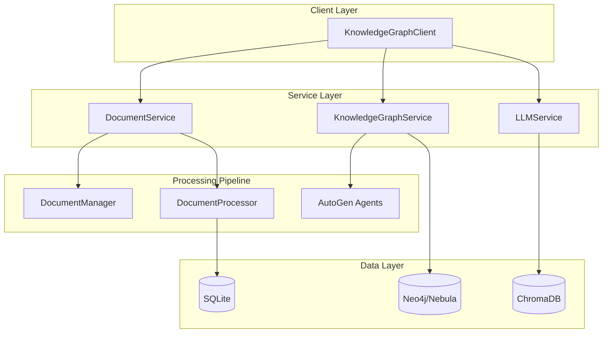

# AI Knowledge Agent

> Python framework for intelligent document processing and knowledge graph construction using multi-agent AI systems.

[](https://www.python.org/downloads/)
[](https://opensource.org/licenses/MIT)

## Overview

AI-powered system that transforms unstructured documents into intelligent knowledge graphs. The system leverages multiple Large Language Models working in collaboration to extract, validate, and enrich semantic relationships from text, creating a comprehensive knowledge representation suitable for advanced AI applications.

## System Architecture



## Technical Requirements

- **Python**: 3.9+
- **LLM API**: OpenAI API key required
- **Optional**: Docker for graph database deployment

### Core Dependencies
- **AI/ML**: `langchain`, `langchain-openai`, `autogen`
- **Databases**: `neo4j-python`, `chromadb`, `sqlite3`
- **Processing**: `pydantic`, `nltk`, `unstructured`

## Installation & Setup

### Quick Start
```bash
# Clone the repository
git clone https://github.com/yourusername/knowledgeAgent.git
cd knowledgeAgent

# Install in development mode
pip install -e .

# Set up environment variables (SECURE)
cp config.example .env
# Edit .env file with your actual API keys and configuration
```

### Docker setup
```bash
# Install from PyPI (when published)
pip install knowledgeAgent

# Start graph database services
docker-compose up -d

# Verify installation
python -c "from knowledgeAgent.api.client import KnowledgeGraphClient; print('✅ Installation successful')"
```

## Examples

### Basic Document Processing
```python
from knowledgeAgent.api.client import KnowledgeGraphClient

# Initialize the client
client = KnowledgeGraphClient(
    graph_db_config={
        "db_type": "neo4j",
        "host": "localhost",
        "port": 7687,
        "database": "knowledge",
        "username": "neo4j",
        "password": "password"
    },
    llm_config={
        "model": "gpt-3.5-turbo",
        "temperature": 0.2,
        "api_key": "your-openai-api-key"
    }
)

# Process a document
document_id = client.add_document(
    document_path="research_paper.md",
    document_type="markdown"
)

# Extract knowledge graph
client.extract_document_ontology(document_id)
```

## License
MIT License - see [LICENSE.txt](LICENSE.txt) for details.


