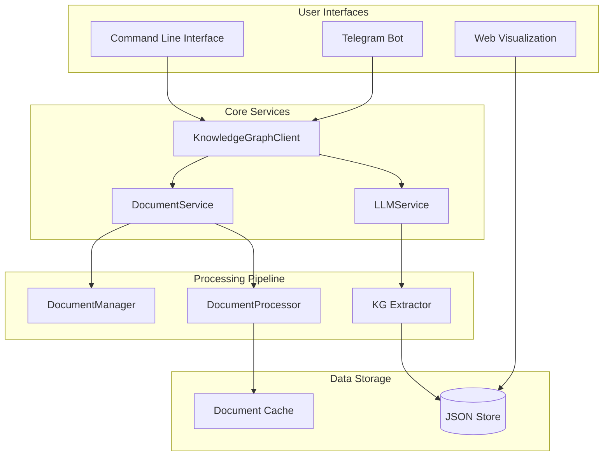

# AI Module - Knowledge Graph System

> Intelligent document processing and knowledge graph construction with integrated Telegram bot and web visualization.

[](https://www.python.org/downloads/)
[](https://opensource.org/licenses/MIT)

## Overview

AI-powered system that transforms unstructured documents into interactive knowledge graphs. Features include document processing, entity extraction, relationship mapping, Telegram bot integration, and real-time web visualization. The system uses OpenAI GPT models with fallback support for local processing.

## System Architecture



## Key Features

- **Document Processing**: Support for .md, .txt, .pdf, .docx files
- **AI-Powered Extraction**: OpenAI GPT integration with fallback modes
- **Knowledge Graphs**: Entity and relationship extraction with deduplication
- **Telegram Bot**: Process documents via chat interface
- **Web Visualization**: Interactive D3.js-powered graph viewer
- **JSON Storage**: File-based storage with no database dependencies
- **Incremental Updates**: Append new documents to existing knowledge graphs

## Technical Requirements

- **Python**: 3.9+
- **Package Manager**: UV (recommended) or pip
- **LLM API**: OpenAI API key (optional - has fallback modes)
- **Telegram Bot**: Bot token (optional)

### Core Dependencies
- **AI/ML**: `kggen`, `litellm`, `openai`
- **Processing**: `pydantic`, `unstructured`, `python-dotenv`
- **Storage**: File-based JSON (no database server required)
- **Visualization**: D3.js, HTML5
- **Bot**: `python-telegram-bot`

## Installation & Setup

### Quick Start
```bash
# Clone the repository
git clone <repository-url>
cd aiModule

# Install dependencies with UV (recommended)
uv sync

# Or with pip
pip install -e .

# Set up environment variables
cp .env.example .env
# Edit .env with your API keys:
# OPENAI_API_KEY=your-openai-key
# TELEGRAM_BOT_TOKEN=your-bot-token (optional)
```

### Environment Configuration
Create a `.env` file with:
```bash
# Required for AI extraction (optional - has fallback)
OPENAI_API_KEY=sk-your-openai-api-key

# Optional for Telegram bot
TELEGRAM_BOT_TOKEN=your-telegram-bot-token

# Optional LLM provider override
KG_LLM_PROVIDER=openai  # or 'ollama' or 'mock'
```

## Usage

### Command Line Interface

#### Process Documents
```bash
# Process a single document
python src/main.py process "path/to/document.md"
python src/main.py process "~/Documents/research.pdf"

# Multiple documents (append to existing knowledge graph)
python src/main.py process "document1.txt"
python src/main.py process "document2.md"  # Adds to existing graph
```

#### Query Knowledge Graph
```bash
# Search entities and relationships
python src/main.py query "machine learning"
python src/main.py query "Python programming"
python src/main.py query "artificial intelligence"
```

#### Telegram Bot
```bash
# Start the Telegram bot
python src/main.py telegram
```

#### Web Visualization
```bash
# Start the visualization server
cd src/vis
uv run server.py

# Open browser to: http://localhost:<port>/src/vis/index.html
```

### Python API
```python
from knowledge_graph import create_json_client

# Process a document
with create_json_client() as client:
    doc_id = client.add_document(
        document_path="research.md",
        document_id="research_doc",
        document_type="markdown"
    )

    # Extract knowledge graph
    client.extract_document_ontology(doc_id)

    # Query the results
    entities = client.search_entities("AI")
    relationships = client.search_relationships("machine learning")
```

## Web Visualization Features

The interactive web visualization (`src/vis/`) provides:

- **Interactive Graph**: Drag, zoom, and click nodes
- **Real-time Search**: Filter by document or entity type
- **Statistics Dashboard**: Entity and relationship counts
- **Visual Customization**: Adjust force physics and node sizes
- **Responsive Design**: Works on desktop and mobile
- **Auto-refresh**: Reflects changes from new document processing

### Visualization Controls
- **Zoom**: Mouse wheel or touchpad gestures
- **Pan**: Click and drag empty areas
- **Node Selection**: Click nodes to highlight connections
- **Force Adjustment**: Use sliders to modify graph physics
- **Document Filter**: Dropdown to show entities from specific documents

## Data Storage

Knowledge graphs are stored in `/database/knowledge_store.json`:
```json
{
  "entities": [
    {
      "id": 1,
      "name": "machine learning",
      "type": "extracted",
      "document_ids": ["doc1", "doc2"],
      "metadata": {...}
    }
  ],
  "relationships": [
    {
      "id": 1,
      "source_entity": "Python",
      "relation_type": "used for",
      "target_entity": "machine learning",
      "document_ids": ["doc1"]
    }
  ]
}
```

## Supported File Formats

- **Markdown** (.md): Full support with metadata extraction
- **Text** (.txt): Plain text processing
- **PDF** (.pdf): Text extraction with layout preservation
- **Word** (.docx): Document structure and content extraction

## Project Structure

```
aiModule/
├── src/
│   ├── main.py                 # CLI entry point
│   ├── knowledge_graph/        # Core KG services
│   ├── bots/                  # Telegram bot integration
│   ├── services/              # JSON knowledge store
│   └── vis/                   # Web visualization
├── database/
│   └── knowledge_store.json   # Knowledge graph storage
├── examples/                  # Sample documents
└── tests/                     # Unit tests
```

## License
MIT License - see [LICENSE.txt](LICENSE.txt) for details.


