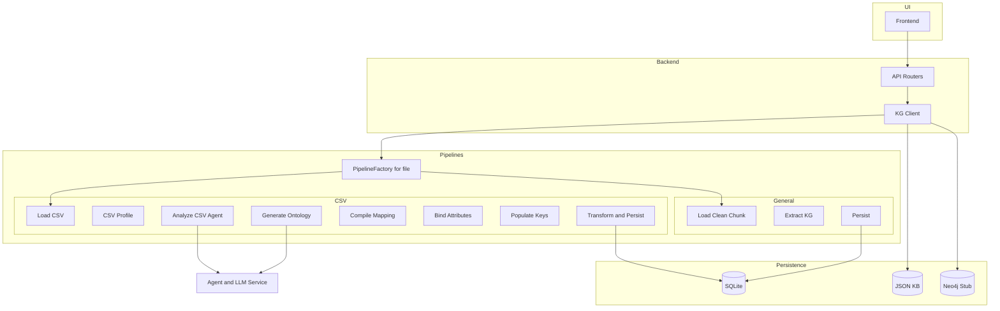

# Knowledge Graph Application (KG Extract)

[](https://www.python.org/downloads/)
[](https://opensource.org/licenses/MIT)

## Overview

Application that ingests documents (PDF/MD/TXT) and tabular CSVs, then builds queryable knowledge graphs. Core principles:
- Deterministic pipeline orchestration (ingestion, validation, transform, persistence)
- Agent proposes ontology/mapping (human‑in‑the‑loop friendly), never writes directly
- Canonical Document model for persistence; CSVDocument used as a tabular helper in pipeline

## Architecture



## Key Features

- Document ingestion for Markdown, Text, PDF; dedicated CSV pipeline
- Agent-assisted ontology and mapping proposal; human-in-the-loop friendly
- Deterministic, step-based orchestration with contextual logging (doc/run IDs)
- SQLite persistence for documents, chunks, and knowledge graphs; JSON/Neo4j stubs
- FastAPI backend with upload and extraction endpoints
- Frontend (Vue + Vite) for uploading, exploring, and visualizing graphs

## CSV Flow (high level)
1) Upload CSV → `client.add_document(file_path)` auto‑generates `doc_id`
2) Pipeline: Load → Profile → Agent Analyze → Ontology → Mapping → Bind Attrs → Populate Keys → Transform & Persist
3) (Planned) Human‑in‑the‑loop: multiple proposals, validation, dry‑run, approval, reuse by dataset fingerprint

## Logging
- Root logger includes InjectContextFilter; all log lines include `doc=... run=...` when available
- Steps log concise summaries; ontology/mapping printed (pretty JSON)
- Control analysis preview size with `KG_AGENT_ANALYSIS_LOG_MAX` (default 2000 chars)
- Override log file via `KG_LOG_FILE` (defaults to `logs/app.log`)

## Requirements

- Python 3.9+
- Node 18+ for frontend
- UV or pip for Python deps; npm for frontend

## Setup

### Backend
- Create and populate a virtualenv; then:
```bash
uv sync  # or: pip install -e .

# Start API (FastAPI + Uvicorn)
bash .startapi.sh
# or
PYTHONPATH=src uvicorn application.api.main:app --host 0.0.0.0 --port 8001 --reload
```

Environment variables (optional):
- `OPENAI_API_KEY`: LLM key if using LLM-backed steps
- `KG_LOG_FILE`: Filepath for logs (defaults to `logs/app.log`)
- `KG_AGENT_ANALYSIS_LOG_MAX`: Limit agent analysis preview length (default 2000)
- `KG_TOOLS_LOG_PREVIEW=1`: Enable CSV preview logging from shared tools

### Frontend
```bash
cd frontend
npm install
VITE_BACKEND_URL=http://127.0.0.1:8001 npm run dev
```
Optional Google Drive integration:
- `VITE_GOOGLE_CLIENT_ID`, `VITE_GOOGLE_API_KEY` if using Drive picker features

## API Endpoints
- `POST /api/documents/upload-csv` (multipart/form-data): Ingest CSV via CSV pipeline
- `POST /api/extract-kg` (multipart/form-data): Generic file ingestion and KG extraction
- `POST /api/documents/upload`: Generic document upload with optional KB association
- `POST /api/documents/register`: Register external/remote docs metadata
- `GET /api/documents`: List registered docs (in-memory demo registry)

Example (CSV upload):
```bash
curl -F "file=@data.csv" -F "kb_id=my_kb" http://127.0.0.1:8001/api/documents/upload-csv
```

## Python Client
```python
from knowledge_graph import create_client
from knowledge_graph.settings.settings import Settings

client = create_client(settings=Settings())
kb = client.create_knowledgebase("demo").id
doc_id = client.add_document("/path/to/data.csv", kb_id=kb)
snapshot = client.get_graph_snapshot(document_id=doc_id)
```

## Supported File Types
- CSV (tabular pipeline)
- Markdown (.md)
- Text (.txt)
- PDF (.pdf)

## Project Structure (high level)
```
.
├── src/
│   ├── application/
│   │   └── api/                 # FastAPI app + routers
│   └── knowledge_graph/         # Core package (client, config, pipelines, persistence)
├── frontend/                    # Vue + Vite frontend
├── database/                    # SQLite databases and JSON registry
├── logs/                        # app.log (configurable via KG_LOG_FILE)
└── docs/                        # docs and design notes
```

## Design Notes
- CSVs may have empty `raw_content`/`clean_content`; persist minimal Document rows
- Prefer joins using target entity keys; normalize join_columns where needed
- Synthesized keys are deterministic (composite/hash) for derived entities
- Validation checks header existence, join integrity, key availability; logs warnings

## License
MIT License – see LICENSE.txt for details.


